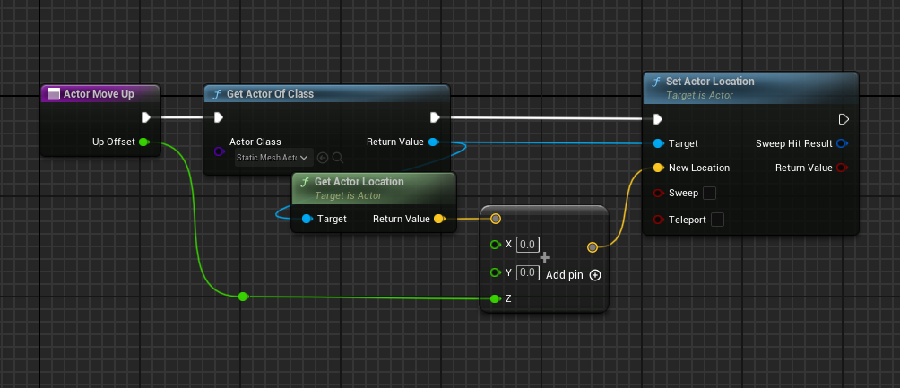

Copyright Ye RongZhen(MapleLeaf_Ye) 2024  
  
  
# NDisplayEventSender  
  
## Description:  
### _Use with nDisplay. Change function or event to multi nodes function or event sended to every node then execute them logic._  
  

# UPDATED:  
## NDisplayEventSender_6.2 update detail  
### *1. The supported types are TArray, TSet, and TMap*  
### *2. UE4.27、UE5.4 will be supported*  
### *3. Add the reset function to pin of the ExecuteMultiNodeEvent_Auto node*  
### *4. Add the ExecuteMultiNodeEvent_Auto node to use standard verification and inform the standard usage of an error message*  
### *5. Rectify the node serialization problem*  
### *6. Add warning pop-ups*  
  
### *1.支持类型TArray，TSet，TMap*  
### *2.将支持UE4.27*  
### *3.ExecuteMultiNodeEvent_Auto节点引脚增加reset类型功能*  
### *4.增加ExecuteMultiNodeEvent_Auto节点使用规范校验，报错告知规范使用*  
### *5.修复节点序列化问题*  
### *6.新增警告弹窗*  
  
# Notes:  
## 1.If you find that the program does not run after using the plugin packaging, check the log and find an error like "ColorCorrectRegions failed to load ", then convert the project to C++ and successfully package the project.  
  
## 2.If you are a pure blueprint project do not want to switch to C++, then please put the plug-in into the engine plug-in directory, so that you can ensure that there is no packaging error, and the program can run normally after packaging.  
  
## 1.如果你发现使用插件打包后程序运行不了，查看日志发现是类似于"ColorCorrectRegions 加载失败"这种错误，那么将工程转化为C++工程即可成功打包。  
  
## 2.如果你是纯蓝图工程不希望转C++，那么请把插件放到引擎插件的目录下，这样可以确保不会打包出错，且打包后程序可以正常运行。  
  
  
 # What do plug-ins do?  
 ## Engine: When using UE's nDisplay architecture, we always struggled to create functions or events (which I'll call multi-node events) that could be executed on individual nodes (devices). Usually, we need to implement the Display Cluster Cluster Event Listener interface provided by nDisplay in an Actor that exists on all nodes. Then Emit JSON cluster event or Emit Binary cluster event API to send a message, distribute the name and parameters of the function to be executed, and then determine which function it is on the interface implementation side. It also involves the conversion of parameter types (all passed are strings or binary). This series of operations is cumbersome, and these multi-node events are not easy to manage. It would be nice to have something that can change normal functions or events, automatically help handle function parameters and distribute events, and implement multi-node events with the help of this thing to be consistent with normal functions or events, with little change. That's what this plugin does.  

 ## Chinese: 在使用UE的nDisplay架构时，我们总是苦于创建可以执行在各个节点（设备）的函数或事件（以下我称之为多节点事件）。通常我们需要在某一个各个节点都存在的Actor实现nDisplay提供的Display Cluster Cluster Event Listener接口，然后在使用Emit JSON cluster event 或者 Emit Binary cluster event API发消息，将需要执行的函数名字，参数等分发过去，然后在接口实现那边具体判断是哪个函数，同时涉及到参数类型的转换（传过来的都是字符串或者二进制）。这一系列的操作十分繁琐，并且这些多节点事件不好管理。那么这个时候就想，如果有那么一个东西可以改变正常的函数或者事件，自动帮助处理函数参数并分发事件的东西就好了，在这个东西的帮助下实现多节点事件与一般的函数或事件一致，几乎没有太大变化。这，就是这款插件带来的功能。
  
# Just like this  
  
  
  

# ***How to use ?***  
  
## Blueprint：  
  
## Step1: Now, if you have a function like this, it's just a normal function  
## 如果你现在有一个这样普普通通的函数  
  
  
## Step2: If you want this piece of logic to be executed on each node you can change it like this  
## 如果你希望将这段逻辑运行在各个节点上可以这样更改  
  
## As you can see, the whole function has not changed much, except to add a plug-in node ExecuteMultiNodeEvent_Auto at the beginning of the function and pass the parameters of the function into this node, but this has already implemented the conversion of the ordinary function to a multi-node event  
## 可以看到整个函数没有太大的改动，只是在函数的最开始添加了一个插件内的节点ExecuteMultiNodeEvent_Auto并将函数的参数传入该节点内，不过这样已经实现了该普通函数转化为多节点事件  
  
## Step3: Now this function can be easily executed anywhere, for example by triggering it from the UI button, and when it is triggered, it will be triggered on each node  
## 现在这个函数可以很方便的在各个地方执行，例如通过UI的按钮触发它，当触发的时候就会触发在各个节点上  
  
  
## C++:  
  
## Step1: If there is a function now, it must be in the reflection system  
## 如果现在有这个函数，这个函数必须是在反射系统中的  
```  
UCLASS()
class NDISMEDIA_API ATestClass : public AActor
{
	GENERATED_BODY()

	UFUNCTION()
	void TestCPP(int32 i, FString s, float f, FSTest STest)
	{
		AActor* a = Cast<AActor>(STest.oTest);
		a->SetActorLocation(a->GetActorLocation() + FVector(0, 0, f));
		GEngine->AddOnScreenDebugMessage(-1, 10.f, FColor::Red, FString::Printf(TEXT("i:%d---s:%s---f:%f \n STest:%s"), i, *s, f, *PrintSMy(my2)));
	}

	FString PrintSTest(const FSTest& STest);
};
```  
  
## Step2: Just place the function's logic between the EXECUTEMULTINODEEVENT_CPP_AUTO_START() and EXECUTEMULTINODEEVENT_CPP_END() macros. At the same time, pass the function's arguments to the EXECUTEMULTINODEEVENT_CPP_AUTO_START() macro to turn the function into a multi-node event    
## 只需要将函数的逻辑放在EXECUTEMULTINODEEVENT_CPP_AUTO_START()和EXECUTEMULTINODEEVENT_CPP_END()宏之间，同时将函数的参数传入到EXECUTEMULTINODEEVENT_CPP_AUTO_START()宏中即可将函数转化为多节点事件  
```  
UCLASS()
class NDISMEDIA_API ATestClass : public AActor
{
	GENERATED_BODY()

	UFUNCTION()
	void TestCPP(int32 i, FString s, float f, FSTest STest)
	{
		EXECUTEMULTINODEEVENT_CPP_AUTO_START(i, s, f, STest);
		AActor* a = Cast<AActor>(STest.oTest);
		a->SetActorLocation(a->GetActorLocation() + FVector(0, 0, f));
		GEngine->AddOnScreenDebugMessage(-1, 10.f, FColor::Red, FString::Printf(TEXT("i:%d---s:%s---f:%f \n STest:%s"), i, *s, f, *PrintSMy(my2)));
		EXECUTEMULTINODEEVENT_CPP_END();
	}

	FString PrintSTest(const FSTest& STest);
};
``` 
  
## Step3: Now this function can be easily executed anywhere, just like a blueprint, and used anywhere  
## 现在这个函数可以很方便的在各个地方执行，就像蓝图那样，在任何地方使用即可  

# ***How many types are supported ?***  
  
## At present, almost all types can be supported under the test, including custom structure/enumeration, object reference pointer type need to pay attention to the existence of each node, the principle of object reference pointer type is passed by soft reference, all plug-ins need each node to hold this object to run without error  
## 目前测试下来几乎所有类型都可以支持，包括自定义结构体/枚举，对象引用指针类型需要注意各个节点存在，原理上对象引用指针类型是通过软引用传递的，所有插件需要各个节点都持有这个对象运行才不会出错  
  
  
# *The full version gets the address*  
# *完整版插件获取地址*  
## **[https://www.unrealengine.com/marketplace/zh-CN/product/c22cb422f71945188c2960264312ca4f](https://www.unrealengine.com/marketplace/zh-CN/product/c22cb422f71945188c2960264312ca4f)**  
  
# Note!!!  
## If your trial version does not support all types, only bool uint8 int32 int64 float double FVector, and does not support CPP function conversion, forcing in unsupported types will cause a crash  
## 如果你是试用版本并不支持所有类型，只支持bool uint8 int32 int64 float double FVector，且不支持CPP的函数转换，强行传入不支持的类型会导致崩溃  
  
# Blueprint use note:  
## 1. You can use ordinary functions or events to call the converted function or event, and can be called continuously, but do not call the same converted function or event (with the same name) several times in a short time, otherwise it may only be executed once  
## 2. Do not call other converted events or functions inside the converted function or event; otherwise, the execution order may be confused and multiple execution may occur  
## 3. Try to write the conversion event on the object that every node will exist (because the conversion node needs to find a function through the object, if written in an object that does not exist in every node, it will cause that node to fail to execute the objective function)  
## 4. Try to use only the ExecuteMultiNodeEvent_Auto node. If ExecuteMultiNodeEvent is required, write the logic to be executed by each node in the NormalExe pin. If host-specific logic is required, write it in MultiNodeExe (because this pin is executed before the host distributes the event, the logic of this pin is not executed on other nodes).  
## 5. The order of the parameters of the conversion function or event must be one-to-one, for example: function parameter 1 must correspond to transition node parameter 1, function parameter 2 must correspond to transition node parameter 2  
## 6. The defined function should not have a return value. If the return value is really needed, the result can be saved to an intermediate class in the logic, and each node can be retrieved
## 7. Converted functions or events can also be executed as ordinary functions in non-ndisplay startup mode without any impact  
  
## 1.可以使用普通函数或者事件去调用被转换后的函数或事件，且可以连续调用，但是不要短时间内调用同一个被转换后的函数或者事件（名字相同的）多次，否则可能只能执行一次  
## 2.正在转换的函数或者事件内部请不要去调用其他已转换的事件或者函数，否则可能会导致执行顺序混乱且多次执行  
## 3.转换事件尽量写在每个节点都会存在的对象上（因为转换节点需要通过该对象寻找函数，如果写在一个非各个结点都存在的对象上会导致那个节点无法执行目标函数）  
## 4.尽量只用ExecuteMultiNodeEvent_Auto节点，如果非要使用ExecuteMultiNodeEvent那么每个节点需要执行的逻辑请写在NormalExe引脚，如果需要主机特例执行逻辑则写在MultiNodeExe（因为该引脚是主机分发事件执行前执行的，其它节点不执行该引脚的逻辑）  
## 5.转换函数或事件的参数顺序必须一对一，例如：函数参数一必须对应转换节点参数一，函数参数二必须对应转换节点参数二  
## 6.定义的函数请不要有返回值，如果实在需要返回值可以实现逻辑内结果保存到一个中间类，各个结点再去取  
## 7.转换过后的函数或事件在非Ndisplay启动模式下也同样可以当普通函数执行，不受任何影响  
  
# ----------------------------------------------------------------------------------------------------  
  
# C++ use note:  
## 1. You can use ordinary functions or events to call the converted function or event, and can be called continuously, but do not call the same converted function or event (with the same name) several times in a short time, otherwise it may only be executed once  
## 2. Do not call other converted events or functions inside the function or event that is being converted; otherwise, the execution order may be confused and multiple executions may occur  
## 3. Try to write the conversion event on the object that every node will exist(because the conversion node needs to find a function through the object, if written in an object that does not exist every node will cause that node to fail to execute the objective function)  
## 4. Execute this function in the first line of the defined function  
## 5. The order of the parameters of the conversion function or event must be one - to - one, for example: function parameter 1 must correspond to transition node parameter 1, function parameter 2 must correspond to transition node parameter 2  
## 6. The defined function please do not have a return value, if the return value is really needed, the result can be saved to an intermediate class in the logic, and each node will be taken  
## 7. Functions and parameters within functions such as struct enumeration must be marked with reflection fields, for example, the converted function must be a function of the UFUNCTION() mark, and its parameters must be USTRUCT or UENUM, which can not be exposed to the blueprint, but must be marked reflection, incorporated into the reflection system  
## 8. Converted functions or events can also be executed as ordinary functions in non-ndisplay startup mode without any impact  
  
## 1.可以使用普通函数或者事件去调用被转换后的函数或事件，且可以连续调用，但是不要短时间内调用同一个被转换后的函数或者事件（名字相同的）多次，否则可能只能执行一次  
## 2.正在转换的函数或者事件内部请不要去调用其他已转换的事件或者函数，否则可能会导致执行顺序混乱且多次执行  
## 3.转换事件尽量写在每个节点都会存在的对象上（因为转换节点需要通过该对象寻找函数，如果写在一个非各个结点都存在的对象上会导致那个节点无法执行目标函数）  
## 4.该函数请放在定义函数的第一行执行  
## 5.转换函数或事件的参数顺序必须一对一，例如：函数参数一必须对应转换节点参数一，函数参数二必须对应转换节点参数二  
## 6.定义的函数请不要有返回值，如果实在需要返回值可以实现逻辑内结果保存到一个中间类，各个结点再去取  
## 7.函数和函数内的参数例如结构体枚举必须使用反射字段标记，例如转换的函数必须是UFUNCTION()标记的函数，其参数必须是USTRUCT或者UENUM，可以不暴露给蓝图，但一定需要标记反射，纳入到反射系统  
## 8.转换过后的函数或事件在非Ndisplay启动模式下也同样可以当普通函数执行，不受任何影响  
  
  
# More information you can download the plug-in access /Content/Blueprint/BP_ExampleActor Blueprint class and NDisplayEventSender/Source/NDisplayEventSender/Public/Example_Ndispla ySender.h header file view case  
# 更多信息可以下载插件访问/Content/Blueprint/BP_ExampleActor蓝图类以及NDisplayEventSender/Source/NDisplayEventSender/Public/Example_NdisplaySender.h头文件查看案例  
  
# Over~